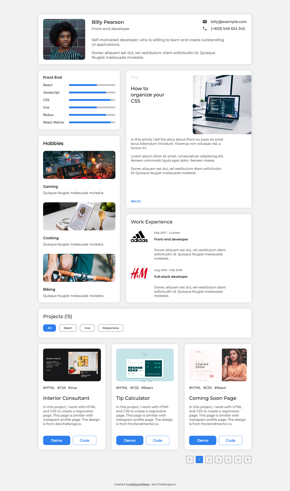

<h1 align="center">devChallenges - Portfolio</h1>

   Solution for a challenge from  <a href="http://devchallenges.io" target="_blank">Devchallenges.io</a>.

  <h3>
    <a href="https://nakoyawilson-devchallenges-portfolio.netlify.app/">
      Demo
    </a>
     | 
    <a href="https://devchallenges.io/solutions/dRchIMOW2ccWbTaprurq">
      Solution
    </a>
     | 
    <a href="https://devchallenges.io/challenges/5ZnOYsSXM24JWnCsNFlt">
      Challenge
    </a>
  </h3>

<!-- TABLE OF CONTENTS -->

## Table of Contents

- [Overview](#overview)
  - [Built With](#built-with)
- [Features](#features)
- [Useful Links](#useful-links)
- [Contact](#contact)
- [Acknowledgements](#acknowledgements)

<!-- OVERVIEW -->

## Overview

### Built With

- [React](https://reactjs.org/)

## Features

This application/site was created as a submission to a [DevChallenges](https://devchallenges.io/challenges) challenge. The [challenge](https://devchallenges.io/challenges/5ZnOYsSXM24JWnCsNFlt) was to build an application to complete the following user stories:

- [x] User story: I can see personal details
- [x] User story: I can see skills
- [x] User story: I can see projects
- [x] User story: I can filter projects by tag
- [x] User story: I can see hobbies or certificates
- [x] User story (optional): I can see experiences
- [x] User story (optional): I can see blogs
- [x] User story (optional): I can see projects on different pages

## Useful Links

- [How TO - CSS Skill Bar](https://www.w3schools.com/howto/howto_css_skill_bar.asp)
- [How to Build a Custom Pagination Component in React](https://www.freecodecamp.org/news/build-a-custom-pagination-component-in-react/)
- [netlify deployment: Failed during stage 'building site': Build script returned non-zero exit code: 2 - Stack Overflow](https://stackoverflow.com/questions/64468843/netlify-deployment-failed-during-stage-building-site-build-script-returned-n)
- [TypeError: (0 , \_react.useEffect) is not a function - Stack Overflow](https://stackoverflow.com/a/70662432) - This Stack Overflow answer was helpful for figuring out why a blank page was being rendered on Netlify while the app worked fine in development.
- [automatically detect web browser window width change? - Stack Overflow](https://stackoverflow.com/a/41752709) - This Stack Overflow answer was helpful for figuring out how to add an event listener to window size.

## Contact

- Website: [Nakoya Wilson](https://nakoyawilson.netlify.app/)
- GitHub: [@nakoyawilson](https://github.com/nakoyawilson)
- Twitter: [@nakoyawilson](https://twitter.com/nakoyawilson)

## Acknowledgements

- Profile Picture by [Etty Fidele](https://unsplash.com/@fideletty) on [Unsplash](https://unsplash.com/)
- Blog Picture by [Christopher Gower](https://unsplash.com/@cgower) on [Unsplash](https://unsplash.com/)
- Gaming Picture by [Branden Skeli](https://unsplash.com/@branden_skeli) on [Unsplash](https://unsplash.com/)
- Cooking Picture by [Jeff Sheldon](https://unsplash.com/@ugmonk) on [Unsplash](https://unsplash.com/)
- Biking Picture by [Dan Russo](https://unsplash.com/@danjrusso) on [Unsplash](https://unsplash.com/)
